# End-to-End Observability Stack with Metrics, Logs, and Tracing in Kubernetes


## 📌 Project Overview

This project implements an end-to-end observability stack for a microservices-based application running on Kubernetes.

The objective is to provide complete visibility into the application and Kubernetes environment through:

* Metrics collection and monitoring
* Centralized application logging
* Distributed request tracing
* Visualization and dashboards

The observability platform helps SRE and development teams understand application health, identify performance issues, analyze failures, centralize logs, and trace request flows across multiple services.

---

## 🎯 Problem Statement

The application was running on Kubernetes, but the development and operations teams faced several observability challenges:

* Developers could not trace the complete request flow across microservices.
* Application logs were scattered across individual Kubernetes pods.
* There was no centralized logging mechanism.
* There was no centralized metrics dashboard.
* Application latency and error rates were difficult to analyze.
* Troubleshooting service-to-service communication was difficult.

To solve these challenges, a complete observability stack was implemented.

---

## 🎯 Project Objectives

The main objectives of this project are:

1. Deploy a microservices application on Kubernetes.
2. Implement Prometheus for metrics collection.
3. Implement Grafana for metrics visualization.
4. Monitor Kubernetes cluster and application metrics.
5. Implement centralized logging using Elasticsearch and Fluent Bit/EFK.
6. Collect and centralize logs from Kubernetes workloads.
7. Implement distributed tracing using Jaeger.
8. Trace service-to-service communication.
9. Visualize latency and error-related metrics.
10. Provide complete observability across metrics, logs, and traces.

---

# 🏗️ Observability Architecture

```text
                           Users / Client
                                |
                                v
                     +----------------------+
                     |   Frontend Service   |
                     +----------+-----------+
                                |
              +-----------------+------------------+
              |                 |                  |
              v                 v                  v
       Order Service     Product Service    Payment Service
              |
              v
       Service-to-Service
          Communication
              |
       +------+-------+
       |              |
       v              v
   Metrics          Traces
       |              |
       v              v
  Prometheus        Jaeger
       |              |
       v              |
    Grafana <---------+
       |
       |
       +--------------------+
       |                    |
       v                    |
  Dashboards                |
                            |
Application Logs            |
       |                    |
       v                    |
   Fluent Bit               |
       |                    |
       v                    |
 Elasticsearch ------------+
```

---

# 🧰 Technologies Used

| Category            | Technology             |
| ------------------- | ---------------------- |
| Cloud Platform      | AWS                    |
| Kubernetes          | Amazon EKS             |
| Containerization    | Docker                 |
| Container Registry  | Amazon ECR             |
| Metrics             | Prometheus             |
| Visualization       | Grafana                |
| Logging             | Elasticsearch          |
| Log Collector       | Fluent Bit / Fluentd   |
| Distributed Tracing | Jaeger                 |
| Operating System    | Windows / Linux        |
| CLI Tools           | AWS CLI, kubectl, Helm |
| Application         | Microservices          |

---

# ☁️ AWS Infrastructure

The application was deployed on Amazon EKS.

The infrastructure included:

* Amazon EKS Cluster
* EKS Managed Node Group
* EC2 Worker Nodes
* VPC and Subnets
* Security Groups
* IAM Roles
* NAT Gateway
* Elastic IP
* Amazon ECR repositories for container images

The EKS cluster was used as the Kubernetes platform for deploying the application and observability stack.

---

# 🐳 Docker Containerization

The application services were containerized using Docker.

Application components included:

* Frontend
* Order Service
* Payment Service
* Product Service

Docker images were built for the application services and pushed to Amazon ECR.

Example commands:

```powershell
docker build -t frontend .
docker build -t order-service .
docker build -t payment-service .
docker build -t product-service .
```

Docker images were verified using:

```powershell
docker images
```

---

# ☸️ Kubernetes Application Deployment

The application was deployed in the following namespace:

```text
observability-app
```

The deployed microservices included:

* Frontend
* Order Service
* Payment Service
* Product Service

To verify application pods:

```powershell
kubectl get pods -n observability-app
```

To verify application services:

```powershell
kubectl get svc -n observability-app
```

Expected application pods:

```text
frontend
order-service
payment-service
product-service
```

All application pods were verified to be in the `Running` state.

---

# 📊 Metrics Setup

## Prometheus and Grafana

The Prometheus and Grafana monitoring stack was installed using Helm.

First, the Prometheus Community Helm repository was added:

```powershell
helm repo add prometheus-community https://prometheus-community.github.io/helm-charts
```

Grafana Helm repository:

```powershell
helm repo add grafana https://grafana.github.io/helm-charts
```

Update Helm repositories:

```powershell
helm repo update
```

Verify repositories:

```powershell
helm repo list
```

The monitoring stack was installed using:

```powershell
helm install prometheus prometheus-community/kube-prometheus-stack -n monitoring
```

If the release already existed:

```text
cannot reuse a name that is still in use
```

the existing Helm release was verified instead of reinstalling it.

Check Helm releases:

```powershell
helm list -n monitoring
```

---

## 🔍 Verify Monitoring Pods

```powershell
kubectl get pods -n monitoring
```

The monitoring namespace contained components such as:

* Prometheus
* Grafana
* Alertmanager
* Prometheus Operator
* Kube State Metrics
* Node Exporter

---

## 🔍 Verify Monitoring Services

```powershell
kubectl get svc -n monitoring
```

Important services included:

```text
prometheus-grafana
prometheus-kube-prometheus-prometheus
prometheus-kube-prometheus-alertmanager
prometheus-kube-prometheus-operator
prometheus-kube-state-metrics
prometheus-prometheus-node-exporter
```

---

# 📈 Access Grafana

Grafana was accessed using Kubernetes port forwarding.

Command:

```powershell
kubectl port-forward svc/prometheus-grafana 3000:80 -n monitoring
```

Grafana was accessed through:

```text
http://localhost:3000
```

If port 3000 was already in use, the process was checked using:

```powershell
netstat -ano | findstr :3000
```

Grafana was then accessed through an available local port if required.

---

# 🔎 Access Prometheus

Prometheus was accessed using:

```powershell
kubectl port-forward svc/prometheus-kube-prometheus-prometheus 9090:9090 -n monitoring
```

Prometheus UI:

```text
http://localhost:9090
```

Prometheus targets were verified through:

```text
Status → Targets
```

The targets were checked for `UP` status.

Example Prometheus queries:

```promql
up
```

```promql
kube_pod_info
```

```promql
node_cpu_seconds_total
```

---

# 📝 Centralized Logging

## Elasticsearch

Elasticsearch was used as the centralized log storage backend.

The objective was to collect logs generated by Kubernetes workloads and store them centrally.

Application logs from services such as:

* Frontend
* Order Service
* Payment Service
* Product Service

were intended to be collected and stored centrally.

---

## Fluent Bit / Fluentd

A log collector such as Fluent Bit or Fluentd was used to collect container logs from Kubernetes nodes.

The logging flow:

```text
Application Container
        |
        v
Kubernetes Container Logs
        |
        v
Fluent Bit / Fluentd
        |
        v
Elasticsearch
        |
        v
Centralized Log Search
```

This allows operators to search and analyze application logs from a centralized location instead of checking individual pods.

Example Kubernetes verification:

```powershell
kubectl get pods -A
```

To check logging components:

```powershell
kubectl get pods -n logging
```

---

# 🔭 Distributed Tracing
## Distributed Tracing

The project architecture is designed to support distributed tracing using Jaeger.

The intended request flow is:
```text
Frontend
    |
    v
Order Service
    |
    v
Payment Service
    |
    v
Jaeger
```

Jaeger helps identify:

* Request flow
* Service-to-service communication
* Request latency
* Slow services
* Failed requests
* Trace duration

The tracing architecture:

```text
User Request
     |
     v
Frontend
     |
     v
Order Service
     |
     v
Payment Service
     |
     v
Jaeger
```

Jaeger UI was used to view the complete request trace.

---

# 📊 Observability Dashboards

Grafana dashboards were used to visualize Kubernetes and application metrics.

The dashboards provided visibility into:

* CPU utilization
* Memory utilization
* Pod status
* Node health
* Request rate
* Application latency
* Error rate

Prometheus collected metrics and Grafana visualized the collected data.

---

# 🔍 Request Path Trace

The distributed tracing flow was visualized using Jaeger.

Example:

```text
Frontend
    |
    +----> Order Service
                |
                +----> Payment Service
```

A Jaeger trace screenshot demonstrates the complete request path and the time spent by each service.

---

# 📸 Project Screenshots

The following screenshots provide evidence of the AWS infrastructure, Kubernetes application deployment, Prometheus monitoring, Grafana dashboards, and observability configuration implemented in this project.

## ☁️ AWS Infrastructure

### EKS Cluster

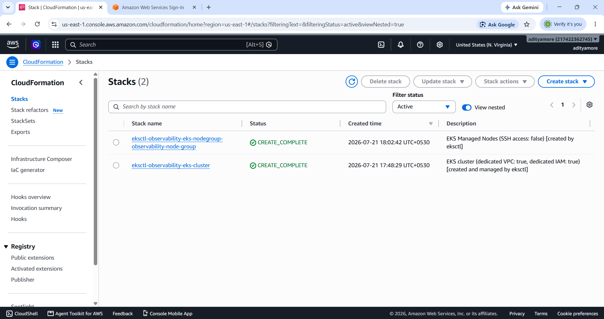

### EKS Cluster Information

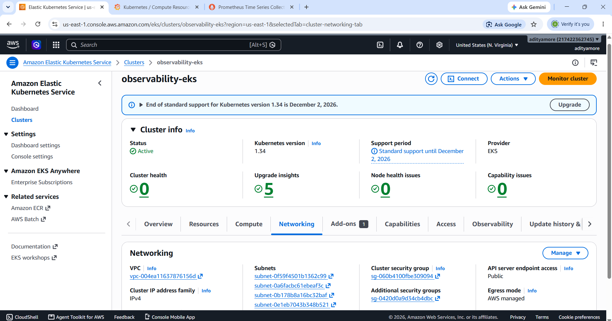

### EKS Worker Nodes

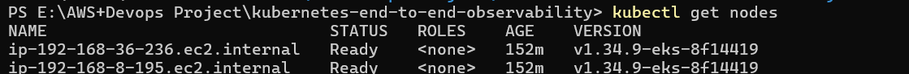

### EC2 Worker Nodes

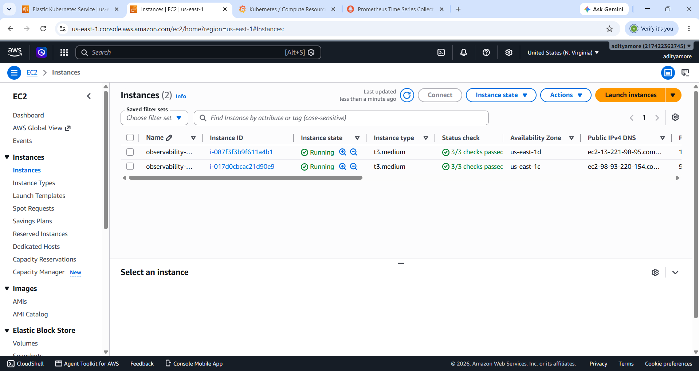

### VPC Configuration

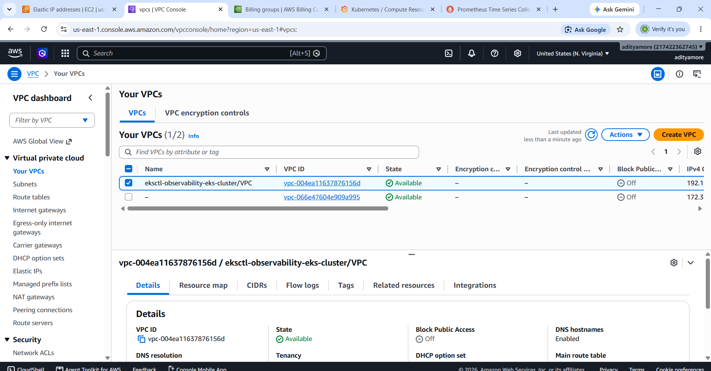

### VPC Subnets

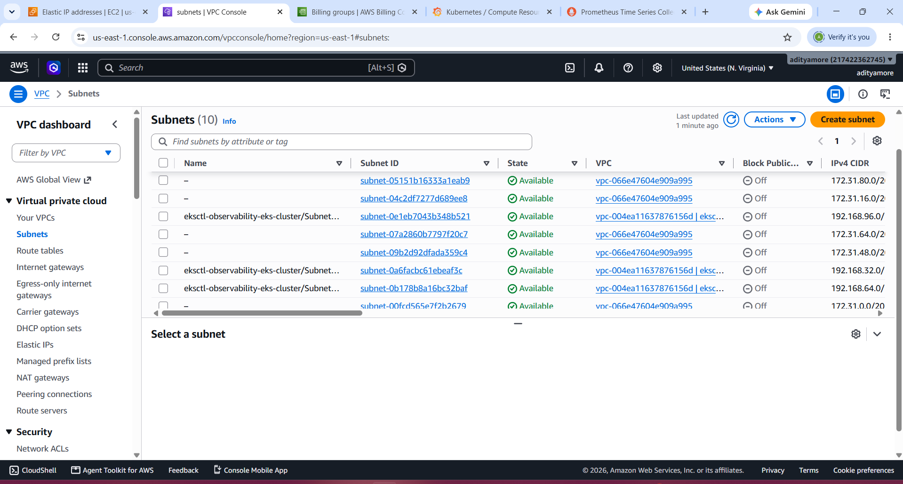

### VPC Route Tables

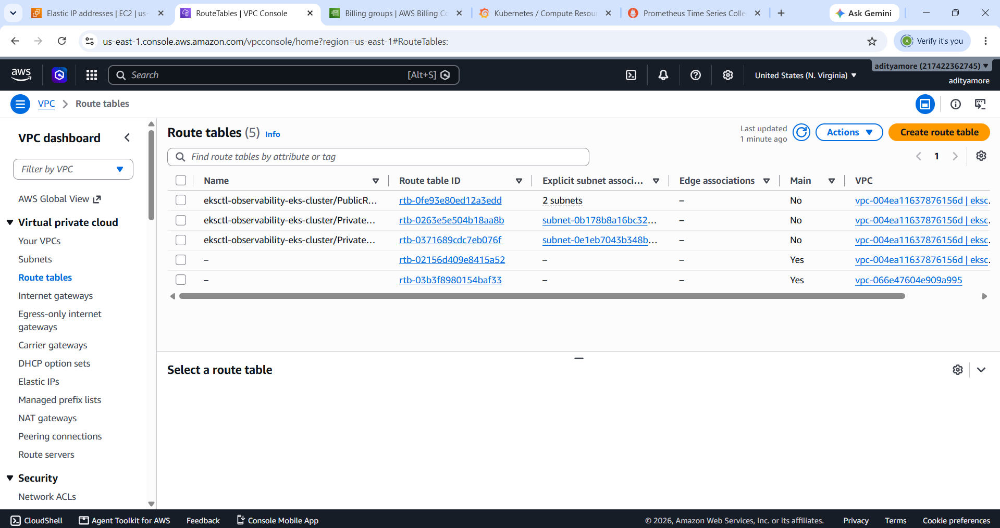


## 🐳 Docker and Amazon ECR

### Docker Desktop Images

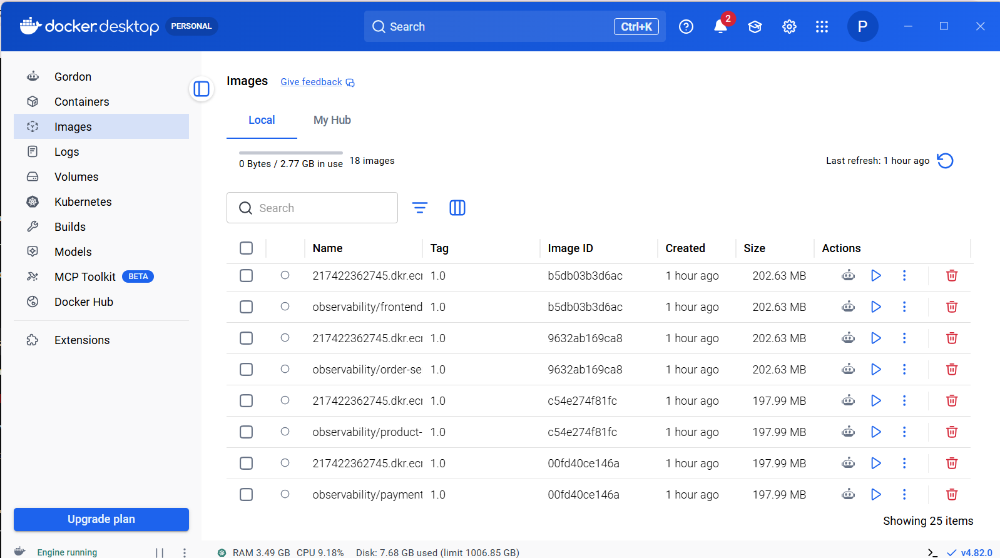

### Amazon ECR Repositories

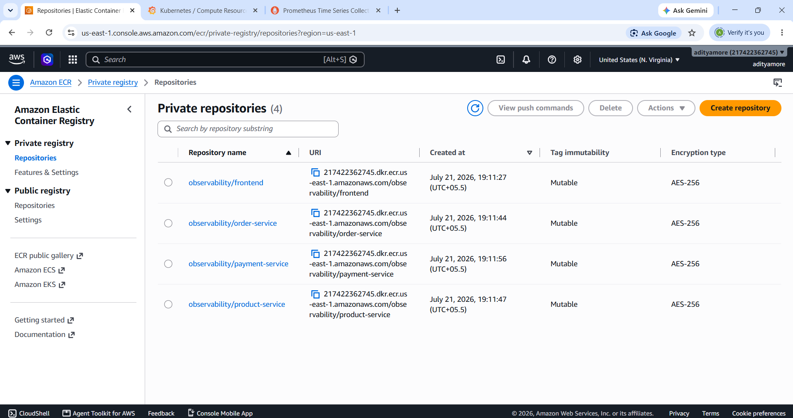


## ☸️ Kubernetes Application

### Application Pods

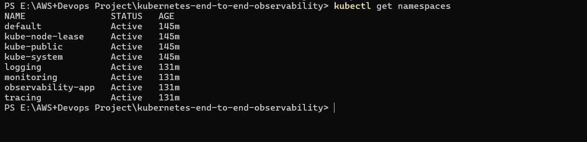

### Application Services

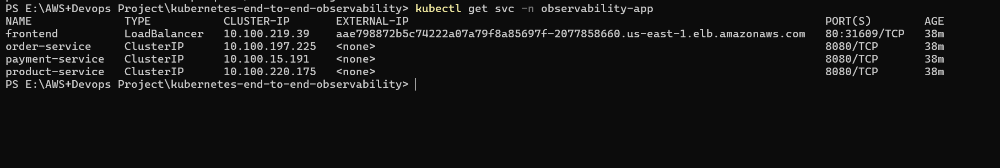

### Application Load Balancer Services

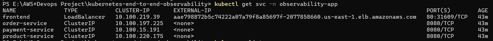


## ⎈ Helm and Monitoring

### Helm Repositories

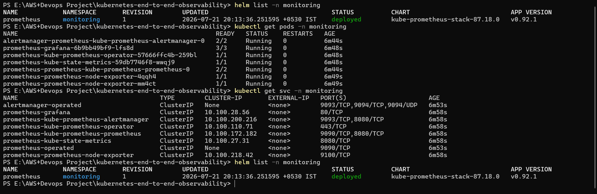

### Helm Releases

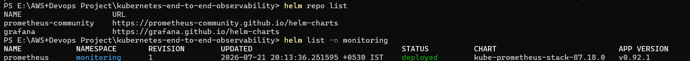

### Monitoring Pods

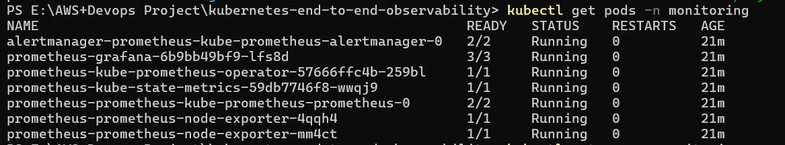

### Monitoring Services

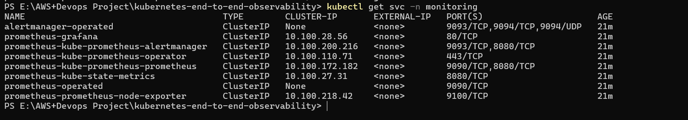


## 📊 Prometheus

### Prometheus Targets

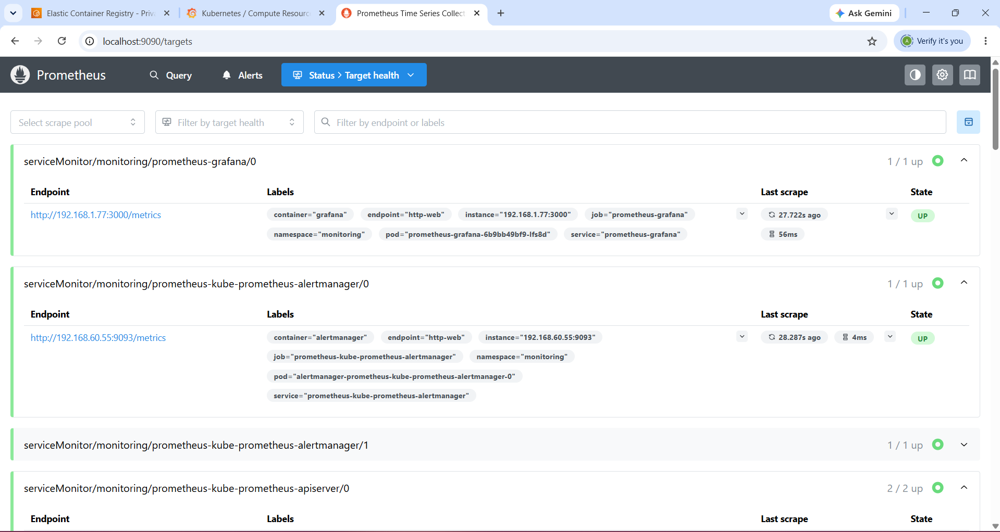

### Prometheus Queries

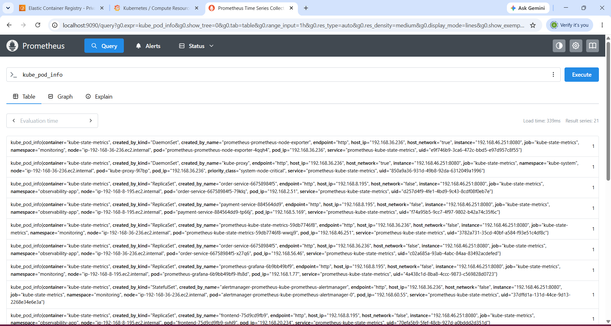

### Prometheus Port Forwarding

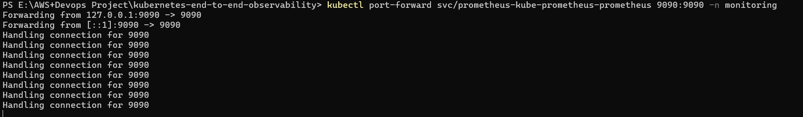


## 📈 Grafana

### Grafana Port Forwarding

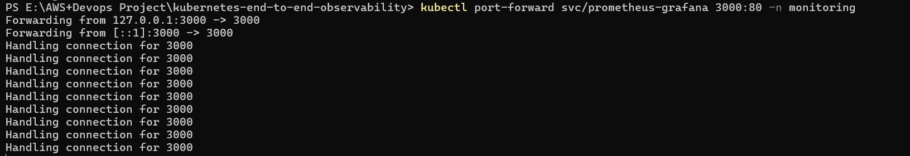

### Grafana Cluster Metrics

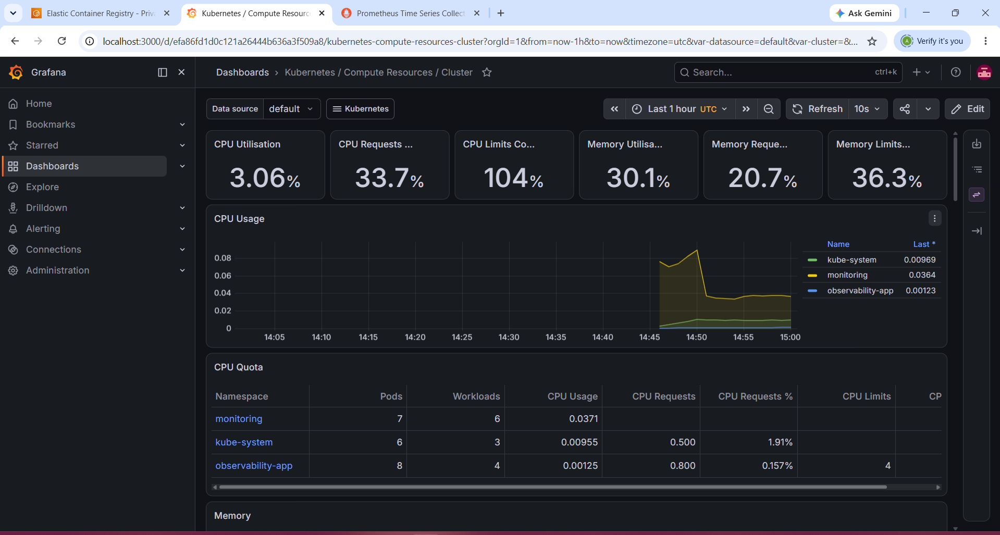

### Grafana Dashboard

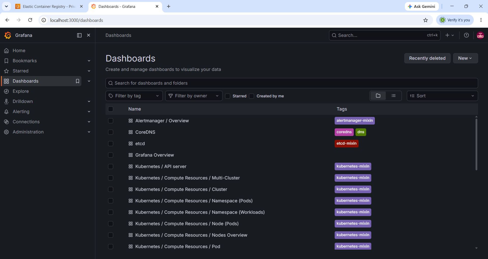


## ☁️ AWS CloudWatch

### CloudWatch Insights

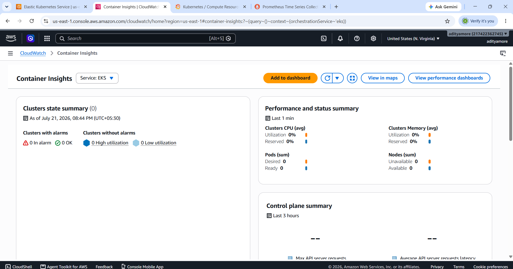


## 📊 Final Observability Dashboard

### Metrics Dashboard

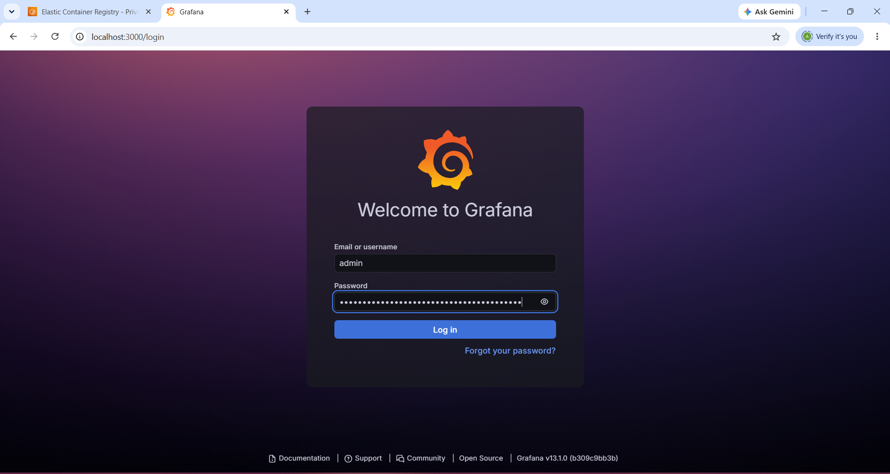

---

# 📸 Recommended Screenshot Evidence

## AWS

* EKS Cluster Overview
* EKS Node Group
* EC2 Worker Nodes
* ECR Repositories

## Kubernetes

```powershell
kubectl get nodes
```

```powershell
kubectl get pods -n observability-app
```

```powershell
kubectl get svc -n observability-app
```

```powershell
kubectl get pods -n monitoring
```

```powershell
kubectl get svc -n monitoring
```

## Metrics

* Prometheus Targets with `UP` status
* Grafana Dashboard
* Kubernetes Cluster Metrics

## Logging

* Elasticsearch Pods
* Fluent Bit Pods
* Centralized Application Logs

## Tracing

* Jaeger UI
* Available Services
* Complete Trace Timeline
* Service-to-Service Request Path

---

# 📁 Project Structure

```text
kubernetes-end-to-end-observability/
│
├── k8s/
│   ├── namespace.yaml
│   ├── frontend-deployment.yaml
│   ├── frontend-service.yaml
│   ├── order-service-deployment.yaml
│   ├── order-service-service.yaml
│   ├── payment-service-deployment.yaml
│   ├── payment-service-service.yaml
│   ├── product-service-deployment.yaml
│   └── product-service-service.yaml
│
├── monitoring/
│   ├── prometheus/
│   └── grafana/
│
├── logging/
│   ├── elasticsearch/
│   └── fluent-bit/
│
├── tracing/
│   └── jaeger/
│
├── screenshots/
│   ├── aws/
│   ├── kubernetes/
│   ├── metrics/
│   ├── logging/
│   └── tracing/
│
├── Dockerfile
├── Jenkinsfile
└── README.md
```

---

# 🚀 Project 5 - End-to-End Observability Stack

## 🛠️ Project Commands

The following commands were used to verify the environment, deploy the Kubernetes observability stack, access Prometheus and Grafana, verify application resources, and clean up AWS resources.


# ============================================================
# 🚀 PROJECT 5 - END-TO-END OBSERVABILITY STACK
# ============================================================

# 📂 1. Navigate to Project Directory

cd kubernetes-end-to-end-observability


# 🛠️ 2. Check Required Tools

aws --version
kubectl version --client
helm version
docker --version


# ☁️ 3. Verify AWS / EKS Connection

aws sts get-caller-identity

kubectl get nodes

kubectl get nodes -o wide


# ☸️ 4. Verify Kubernetes Application

kubectl get namespaces

kubectl get pods -n observability-app

kubectl get svc -n observability-app

kubectl get deployments -n observability-app


# 🔍 5. Check All Kubernetes Resources

kubectl get pods -A

kubectl get svc -A

kubectl get deployments -A


# 📦 6. Add Prometheus Community Helm Repository

helm repo add prometheus-community https://prometheus-community.github.io/helm-charts


# 📊 7. Add Grafana Helm Repository

helm repo add grafana https://grafana.github.io/helm-charts


# 🔄 8. Update Helm Repositories

helm repo update


# 📋 9. Verify Helm Repositories

helm repo list


# 📁 10. Create Monitoring Namespace

kubectl create namespace monitoring


# 📈 11. Install Prometheus and Grafana Stack

helm install prometheus prometheus-community/kube-prometheus-stack -n monitoring


# ✅ 12. Verify Helm Release

helm list -n monitoring


# 🔎 13. Verify Monitoring Pods

kubectl get pods -n monitoring


# 🌐 14. Verify Monitoring Services

kubectl get svc -n monitoring


# 📊 15. Access Grafana

kubectl port-forward svc/prometheus-grafana 3000:80 -n monitoring

# Grafana URL
# http://localhost:3000


# 🔍 16. Access Prometheus

kubectl port-forward svc/prometheus-kube-prometheus-prometheus 9090:9090 -n monitoring

# Prometheus URL
# http://localhost:9090


# 🎯 17. Verify Prometheus Targets

kubectl get servicemonitors -n monitoring

kubectl get prometheuses -n monitoring


# 📝 18. Check Application Logs

kubectl logs -n observability-app deployment/frontend

kubectl logs -n observability-app deployment/order-service

kubectl logs -n observability-app deployment/payment-service

kubectl logs -n observability-app deployment/product-service


# 🔍 19. Check All Pods

kubectl get pods -A


# 🌐 20. Check All Services

kubectl get svc -A


# 📦 21. Check Helm Releases

helm list -A


# 🧪 22. Final Observability Verification

kubectl get nodes

kubectl get pods -n observability-app

kubectl get svc -n observability-app

kubectl get pods -n monitoring

kubectl get svc -n monitoring

helm list -A


# 🧹 23. Cleanup - Delete Application Namespace

kubectl delete namespace observability-app


# 🧹 24. Cleanup - Uninstall Monitoring Stack

helm uninstall prometheus -n monitoring

kubectl delete namespace monitoring


# 🌐 25. Check Elastic IP

aws ec2 describe-addresses --public-ips 54.198.6.132


# 🔗 26. Find NAT Gateway Associated with Elastic IP

aws ec2 describe-nat-gateways --filter "Name=state,Values=available,pending" --query "NatGateways[?NatGatewayAddresses[?AllocationId=='eipalloc-0e7fa7a5576c5e130']].{NatGatewayId:NatGatewayId,State:State}" --output table


# 🗑️ 27. Delete NAT Gateway

aws ec2 delete-nat-gateway --nat-gateway-id NAT_GATEWAY_ID


# 🌐 28. Release Elastic IP

aws ec2 release-address --allocation-id eipalloc-0e7fa7a5576c5e130


# ✅ 29. Verify Elastic IP Release

aws ec2 describe-addresses --public-ips 54.198.6.132


# 🔎 30. Final AWS Resource Check

aws ec2 describe-instances --query "Reservations[].Instances[].{ID:InstanceId,State:State.Name,PublicIP:PublicIpAddress}" --output table

aws ec2 describe-nat-gateways --query "NatGateways[].{ID:NatGatewayId,State:State}" --output table

aws ec2 describe-addresses --output table

---


# 🧪 Verification Commands

Check Kubernetes nodes:

```powershell
kubectl get nodes
```

Check all pods:

```powershell
kubectl get pods -A
```

Check application pods:

```powershell
kubectl get pods -n observability-app
```

Check application services:

```powershell
kubectl get svc -n observability-app
```

Check monitoring pods:

```powershell
kubectl get pods -n monitoring
```

Check monitoring services:

```powershell
kubectl get svc -n monitoring
```

Check Helm releases:

```powershell
helm list -A
```

Check Helm repositories:

```powershell
helm repo list
```

---

# 🧹 Cleanup

After completing the project and capturing all screenshots, AWS resources can be cleaned up to avoid unnecessary charges.

Monitoring stack:

```powershell
helm uninstall prometheus -n monitoring
```

Delete monitoring namespace:

```powershell
kubectl delete namespace monitoring
```

Delete application namespace:

```powershell
kubectl delete namespace observability-app
```

EKS cluster and AWS infrastructure should be deleted after confirming that no resources are required.

Before releasing an Elastic IP, check its association:

```powershell
aws ec2 describe-addresses --public-ips 54.198.6.132
```

If the Elastic IP is associated with a NAT Gateway, the NAT Gateway must be deleted first.

---

# 🎯 Project Outcome

This project implements an end-to-end observability architecture for a Kubernetes-based microservices application.

The solution provides:

* **Metrics** using Prometheus
* **Visualization** using Grafana
* **Centralized logging** using Elasticsearch and Fluent Bit/Fluentd
* **Distributed tracing** using Jaeger
* **Kubernetes cluster monitoring**
* **Application monitoring**
* **Centralized log analysis**
* **Service-to-service request tracing**

The observability stack enables SRE and development teams to monitor application health, analyze performance, identify failures, search centralized logs, and trace requests across distributed microservices.

---

# 🚀 Future Enhancements

* Add Alertmanager notification integrations
* Configure Grafana alerting
* Add OpenTelemetry for standardized telemetry collection
* Add Loki as an alternative lightweight logging backend
* Add service-level objectives (SLOs)
* Implement automated incident alerting
* Integrate observability into CI/CD pipelines

---

# 👩‍💻 Author

**Aditya More**

AWS | DevOps | Kubernetes | Cloud Engineering barobar ahe na all
